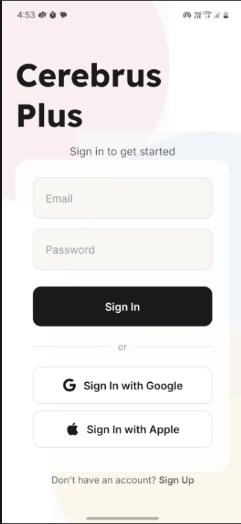
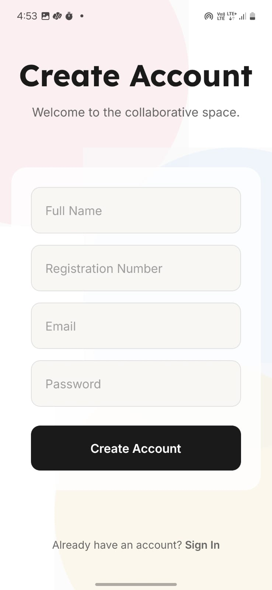
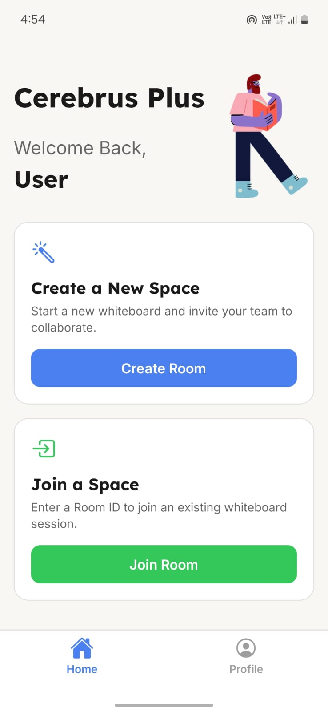
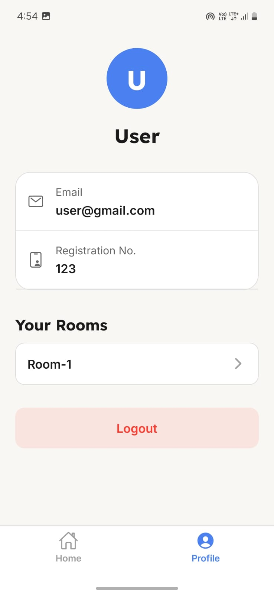
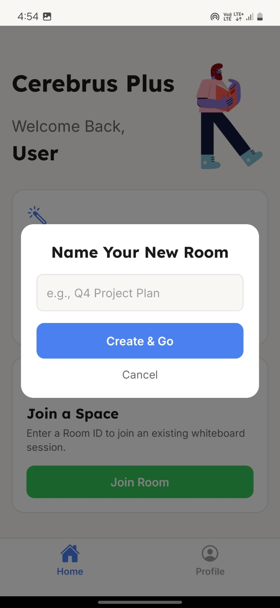
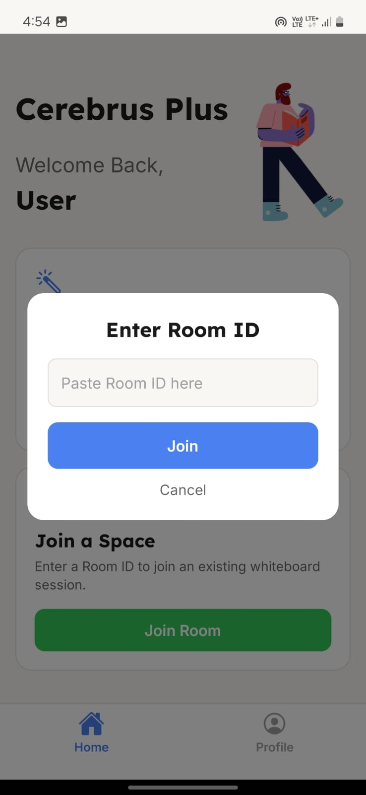
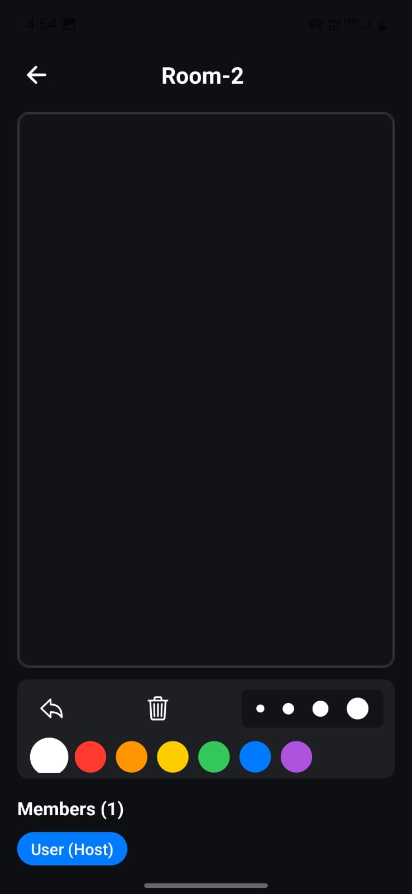

# 🎨 Cerebrus-Plus

### A real-time, collaborative whiteboard application built with modern, high-performance technologies.


<br/>

<p align="center">
  
</p>

---

## ✨ About The Project

Cerebrus-Plus is a feature-rich, cross-platform mobile application that enables users to collaborate on a shared digital whiteboard in real-time. Built from the ground up with a focus on performance and modern UI/UX, this project leverages the power of **React Native Skia** for a smooth, high-performance drawing experience and **Google Firebase** for secure, real-time data synchronization.

---

## 📸 Screenshots

<table>
  <tr>
    <td align="center"><br><sub><b>Login Screen</b></sub></td>
    <td align="center"><br><sub><b>Home Screen</b></sub></td>
    <td align="center"><br><sub><b>Profile Screen</b></sub></td>
  </tr>
  <tr>
    <td align="center"><br><sub><b>Real-time Whiteboard</b></sub></td>
    <td align="center"><br><sub><b>Toolbar & Tools</b></sub></td>
    <td align="center"><br><sub><b>Live Member List</b></sub></td>
  </tr>
</table>

---

## 🚀 Features

* **High-Performance Drawing Canvas:** Built with **React Native Skia** for a fluid, 60 FPS drawing experience.
* **Real-time Collaboration:** Strokes appear instantly on all users' devices in the same room, powered by **Cloud Firestore** real-time listeners.
* **Secure User Authentication:**
    * ✅ Email & Password Sign-Up / Sign-In
    * ✅ **Google Sign-In** Integration
    * ✅ **Apple Sign-In** Integration
    * Session persistence ensures users stay logged in.
* **Room Management:** Users can create new private rooms or join existing rooms via a unique Room ID.
* **Modern UI/UX:**
    * Beautiful, custom-designed light theme with aurora-style gradient backgrounds.
    * Custom fonts (**Lexend** for headers, **Inter** for body).
    * Polished, card-based layouts with soft shadows and rounded corners.
* **Advanced Drawing Tools:**
    * Dynamic color and thickness selectors.
    * Eraser functionality.
    * Undo the last drawn stroke.
* **Live Member List:** See who is currently in the room, with the original creator marked as "(Host)".

---

## 🛠️ Tech Stack

This project is built with a modern, scalable tech stack:

| Technology         | Description                                        |
| ------------------ | -------------------------------------------------- |
| **React Native** | Core framework for building cross-platform apps.   |
| **Expo** | Toolchain for building and iterating on the app.   |
| **Expo Router** | File-based navigation for a clean project structure. |
| **TypeScript** | For type safety and robust, scalable code.         |
| **Firebase Auth** | Handles all user authentication and sessions.      |
| **Cloud Firestore**| Real-time NoSQL database for syncing drawings & rooms. |
| **React Native Skia**| High-performance 2D graphics engine for the canvas.|

---

## ⚙️ Getting Started

To get a local copy up and running, follow these simple steps.

### Prerequisites

* Node.js & npm
* Expo Go app on your mobile device

### Installation

1.  **Clone the repo**
    ```sh
    git clone [https://your-repository-url.com/Cerebrus-Plus.git](https://your-repository-url.com/Cerebrus-Plus.git)
    cd Cerebrus-Plus
    ```
2.  **Install NPM packages**
    ```sh
    npm install
    ```
3.  **Set up your Firebase credentials**
    * Create a `.env` file in the root of the project.
    * Add your Firebase project configuration keys, prefixed with `EXPO_PUBLIC_`.
        ```env
        EXPO_PUBLIC_API_KEY="YOUR_API_KEY"
        EXPO_PUBLIC_AUTH_DOMAIN="YOUR_AUTH_DOMAIN"
        EXPO_PUBLIC_PROJECT_ID="YOUR_PROJECT_ID"
        # ...and so on
        ```
    * Set up Google Sign-In and create the necessary Firestore Indexes as per the Firebase console instructions.

4.  **Run the app**
    ```sh
    npm start
    ```
    Scan the QR code with the Expo Go app.

---

## 📜 License

Distributed under the MIT License. See `LICENSE` for more information.
